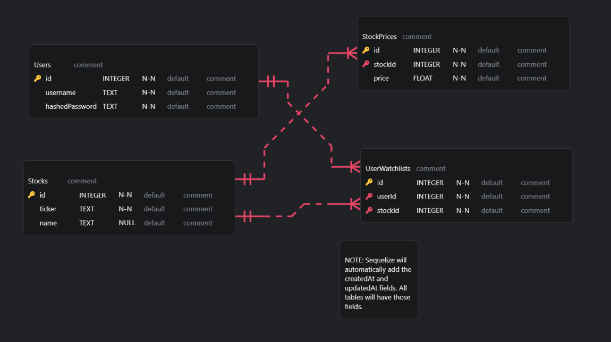

# real-time-stocks
Welcome to the "real-time-stocks" app. I tried to keep the design and code as simple as possible while still being modular enough to allow for new features to be added. The app itself can be ran entirely locally using docker compose. Alternatively, you can run the frontend and backend without docker if you would like. Directions for both approaches are included below.

The data comes courtesy of a package called [faker](https://www.npmjs.com/package/@faker-js/faker). Faker generates data that is convincingly real as opposed to obvious placeholder data.

# Getting Started
1. Clone the repository.
2. Install and setup docker.
3. `docker-compose up`

# Backend
Language: Typescript
Frameworks: 
- Express - The backend web application framework.
- SQLite3 - A simple and portable database that can easily run inside docker.
- Sequelize - The ORM layer.
- Nodemon - Useful for local testing and auto reloading code on changes.

## To Start the App Locally (Without Docker - YMMV based on your underlying OS)
1. `npm install`
2. `export APP_PORT=8080`
3. With Auto Reload: `npm run start:nodemon`

## To start with Docker
TBD

## REST API Routes
### Health Check
- [GET `/api/v1/health`](backend/src/routes/health/get.ts) - a basic health check route

### Stocks
- [GET `/api/v1/stocks&page=<num>&size=<num>`]() - get a paginated list of all stocks
- [GET `/api/v1/stocks/:id`]() - get a single stock's details
- [GET `/api/v1/stocks/:id/price`]() - get a paginated list of a single stock's price history

### User Management
- [POST `/api/v1/users`]() - sign up a new user
  - ```
    {
        "username": "string",
        "hashedPassword": "string"
    }
    ```
- [POST `/api/v1/users/login`]() - sign up a new user
  - ```
    {
        "username": "string",
        "hashedPassword": "string"
    }
    ```

### User Watchlist (Protected with JWT)
All requests must include a valid user JWT using an `authorization` header
- [POST `/api/v1/users/:userId/watchlist/:stockId`]() - add a stock to the user's watch list
- [GET `/api/v1/users/:userId/watchlist&page=<num>&size=<num>`]() - get a paginated list of all stocks on the user's watch list
- [DELETE `/api/v1/users/:userId/watchlist/:stockId`]() - remove a stock from a user's list

## [Database](backend/src/database/)
The ERD is below.


### [Models](backend/src/database/models/)
- `Users` - Stores basic information about a user
- `Stocks` -
- `StockPrices` - 
- `UserWatchlists` - a junction table that allows us to query a user's watch list

# Frontend
Language: Javascript
Frameworks: 
- React
- MUI
- axios

# Docs
- [models.erd](docs/models.erc) - An ERD diagram as JSON. Viewable with the VS Code extension [here](https://marketplace.visualstudio.com/items?itemName=dineug.vuerd-vscode).

# Things I Would do if I Had More Time
- Real timestamps in the randomly generated data. This would require a pretty invovled algorithm to back date the records and make it look like a real stock price changing every minute or so.
- Fix the Sequelize model types. I had never used Sequelize with typescript and getting Typescript to understand the initialized sequelize model types was taking a little too long so I went with `any` types for those.
- Testing. SInce most of this was database ops, unit tests would require mocking. I would like to add those to help improve the overall robustness of the app.
- Adding a linter/formatter would be important as well.
- Document API with OpenAPI spec.